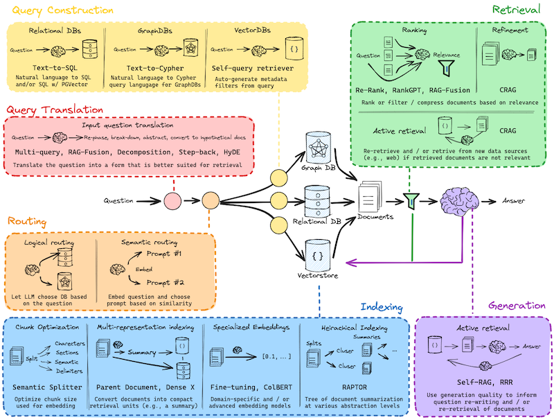

# Assistant with RAG

## Окружение запуска
- Python 3.13
- Docker и Docker Compose
- Jupyter Lab и Jupyter Notebook
- Ollama


## Краткое описание элементов 
- [Ollama](https://ollama.com/) - это инструмент для работы с моделями LLM, который позволяет запускать и использовать модели на локальной машине. Он поддерживает различные модели, такие как Llama 2, Mistral и другие.
- [Qdrant](https://qdrant.tech/) - это векторная база данных, которая позволяет хранить и обрабатывать векторные представления данных. Она используется для хранения эмбеддингов и выполнения запросов на основе них.
- [LangChain](https://python.langchain.com/docs/introduction/) - это библиотека для работы с LLM, которая предоставляет инструменты для создания приложений на основе языковых моделей, в том числе Агентного поиска, обработки текста и других задач.
- [Jupyter Notebook](https://jupyter.org/) - это интерактивная среда для работы с Python и другими языками программирования. Она позволяет создавать и делиться документами, содержащими код, текст и визуализации.
- [RAG (Retrieval-Augmented Generation)](https://arxiv.org/abs/2005.11401) - это подход к генерации текста, который использует внешние источники информации для улучшения качества генерируемого текста. Он сочетает в себе методы поиска и генерации текста, что позволяет создавать более точные и информативные ответы на запросы пользователей.
- [mxbai-embed-large](https://huggingface.co/mixedbread-ai/mxbai-embed-large-v1) - это модель эмбеддинга, которая используется для преобразования текстов в векторные представления. Она позволяет эффективно представлять текстовые данные в виде векторов, что упрощает их обработку и анализ.
- [gemma3](https://huggingface.co/google/gemma-3-12b-it) - это новая модель от Google, для генерации текста на основе входных данных. Она может быть использована для создания различных приложений, таких как чат-боты, системы рекомендаций и другие.


## Архитектура RAG


Источник - https://d3lkc3n5th01x7.cloudfront.net/wp-content/uploads/2024/08/26051537/Advanced-RAG.png


## Архитектура langchain


Источник - https://github.com/langchain-ai/rag-from-scratch/blob/main/rag_from_scratch_10_and_11.ipynb

## Ollama
- Установка Ollama:
```bash
brew install ollama/tap/ollama
```
- Запуск Ollama:
```bash
export OLLAMA_TIMEOUT=600s  # Увеличиваем таймаут API до 10 минут
export OLLAMA_DEBUG=true    # Включаем режим отладки
ollama pull mxbai-embed-large
ollama run gemma3:12b-it-q4_K_M
ollama serve
```


## Запуск окружения в Docker
```bash
docker compose up -d 
```


## Проверка работы

- [Qdrant dashboard](http://localhost:6333/dashboard)
- [Ollama endpoint](http://localhost:11434)


