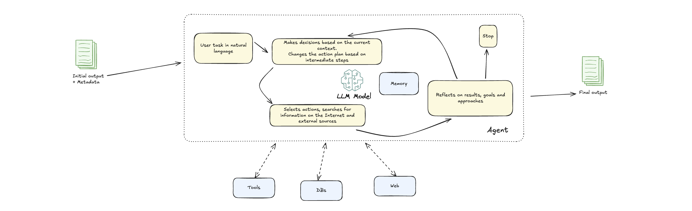

# Варианты использования AI (LLM) в Data Intensive системах

## [Минимальная теория и термины](docs/readme.md)

## Ограничения изысканий

- Данные не могут покидать организации. Только on premise решения.

## [Оборудование для запуска внутри компании](./docs/EnterpriseHardware.md)

## [Подготовка MacBook для разработки](./docs/MacBookLLMSetupGuide.md)

## Встраивание ИИ в бизнес-процессы, трансформация

### Упрощение существующих процессов для ускорения (Low-hanging fruits, просто)

В самом простом случае закрывается общими корпоративными решениями типа Чата с LLM. Более сложные варианты - встраивание в существующие программные решения (CRM, ERP, BPM, BI, ECM и т.д.)

Также сюда можно отнести всякие рекомендательные системы, которые уже давно используются в бизнесе.

Примеры:

- Текст документации пишет технический писатель >>> тех-писатель редактирует автогенерацию ИИ
- При выборе из нескольких вариантов система сначала предлагает лучший вариант на основе анализа данных

### Пересмотр процессов с учётом LLM (Средне сложно, основной фокус трансформации)

Мы смотрим, какие этапы в текущем процессе потеряли смысл и могут быть автоматизированы с помощью ИИ. Как правило требуется пересмотр ролей людей и их навыков.

Примеры:

- "нулевая линия": сначала отвечает чат-бот, только потом переключение на оператора
- Автоматизируем цикл закрытия документов ("ИИ-фабрика отчётов" — данные из ERP, 1С, API Контрагентов)
- VSCode + корпоративный "Copilot"

### Построение процессов вокруг LLM (AI-First, сложно)

Примеры:

- Поиск новых органических соединений с нужными свойствами.
- Создание новых продуктов и услуг на основе возможностей ИИ

## Сценарии использования

### Задачи ML/Алгоритмы

- Обработка естественного языка (NLP), включая анализ тональности, парсинг, перевод
- Компьютерное зрение и OCR
- Поиск деревьев решений с заданной вероятностью по данным
- Рекомендательные системы

### Задачи для корпоративной on premise LLM (+)

- Генерация ответов на общие запросы пользователей
- Генерация SQL запросов по описанию задачи на естественном языке
- Генерация кода по описанию задачи
- Генерация документации по коду
- Генерация тестов по коду и описание задачи

### Агентное взаимодействие

- Поиск информации по внутренним документам и базам данных c помощью RAG - [Serch with RAG](./SearchPortal/readme.md)
- Суммаризация сообщений в корп чатах и отправка дайджестов
- Оценка качества кода и PR
- VSCode + корпоративный "Copilot" - [IDE + Автопродление кода](./CodeAutocomplete/readme.md)
  - Генерация Авто-тестов
  - Генерация Документации
- Виртуальный ассистент сотрудника с нормативкой, правилами и новостями компании

### Личная эффективность сотрудника (локально)

- Локальный чат - [LM Studio](https://lmstudio.ai) или [Ollama](https://ollama.com)
- Личный ассистент при подключении к Jira, Почте и Календарю
  - Автоматизация рутинных задач
  - Помощь в планировании и управлении временем
- Личный помощник в переговорах при подключении к видеоконференциям и корпоративным данным (внешние)
  - Поддержка в подготовке материалов и анализе данных

### Агент ответов по внутренней выделенной области информации

- подключается к определённым разделам Confluence, Jira, Bitbucket и Документации и предоставляет советы только по этим разделам.

### Контроль процесса разработки

- Выделение важного из большого потока данных и Суммаризация информации
- Инцидент помощник
- Репорт по ревью кода и PR
- Release Notes на основе Jira или GitLab

### Работа с данными

- Генерация синтетических данных по структурам таблиц
- Сопоставление данных из разных источников, работа внутри ETL/ELT процессов
- Семантическое сопоставление сущностей, кластеризация (+)
- Валидация данных PostgreSQL, Data QA, выявление аномалий в данных
- Маскирование данных
  